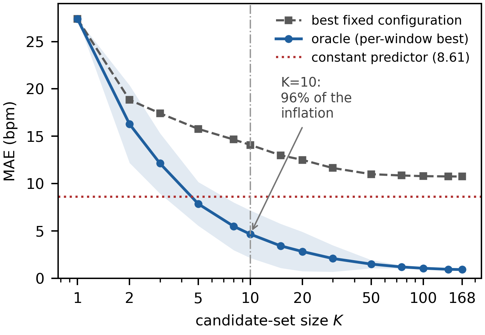
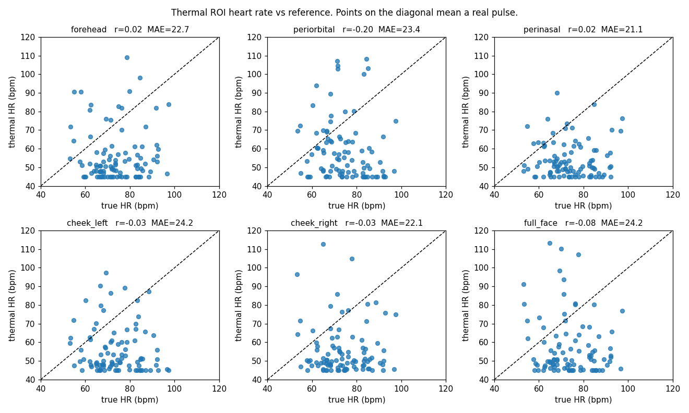
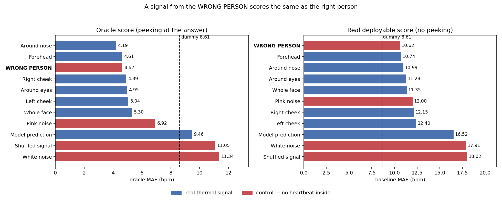

# oracle-inflation

Code and result tables for:

**How Much Does Oracle Selection Inflate? Realistic Search Sizes and a
Perfusion-Based Thermal Cardiac Null**
Submitted to ICASSP 2027.

Two things are measured here. First, how much a ground-truth oracle bound
is inflated by the act of selecting among candidate configurations, as a
function of how many candidates are searched. Second, a null result on
facial thermal video that provides the substrate for that measurement:
because the cardiac signal is demonstrably absent, any apparent skill the
oracle shows must come from the selection itself.

## Headline numbers

| Quantity | Value |
|---|---|
| Constant predictor (always 74.6 bpm) | 8.61 bpm MAE |
| Best fixed configuration of 168 | 10.74 bpm |
| Best quality index (zero-crossing rate) | 18.03 bpm |
| Oracle over all 168 candidates | 0.91 bpm |
| Oracle on a **different subject's** thermal signal | 4.62 bpm (vs 4.61 for the correct subject) |

Oracle score against candidate-set size K:

| K | 1 | 5 | 10 | 20 | 168 |
|---|---|---|---|---|---|
| Oracle | 27.38 | 7.85 | 4.65 | 2.82 | 0.91 |
| Best fixed | 27.38 | 15.77 | 14.08 | 12.50 | 10.74 |

Five candidates are enough for a signal-free estimator to beat the
constant predictor. Ten recover 96% of the inflation available at 168.



*Nothing about the data changes along the horizontal axis. Only the
number of candidates searched changes, and the oracle drops below the
constant predictor at K = 5.*

## Requirements

Python 3.10 or newer, with numpy, scipy, pandas and matplotlib.

```
pip install numpy scipy pandas matplotlib
```

The dataset is [iBVP](https://doi.org/10.3390/electronics13071334) (Joshi
and Cho, 2024), which must be obtained from its authors. Some scripts
additionally need an rPPG-Toolbox preprocessed cache; see below.

## Configuration

Every script has a configuration block at the top with empty path
strings. Fill these in before running; a script exits with a message if
they are left blank.

| Name | What it points at |
|---|---|
| `DATASET` | root of `iBVP_Dataset_ready`, one folder per session |
| `CACHE` | rPPG-Toolbox preprocessed cache for the fold being analysed, holding `<video>_input<N>.npy` and `<video>_label<N>.npy` |
| `ROOT` / `BASE` | working directory holding stage outputs |
| `OUTDIR` / `OUT` | where a script writes its tables and figures |

## Order of execution

The stage scripts build on each other and should be run in order. The
check scripts are independent and can be run at any point.

### Pipeline

| Script | What it does |
|---|---|
| `stage0_inventory.py` | verifies the dataset: 96 sessions, 24 subjects, frame counts, reference quality columns |
| `stage1_build_signals.py` | assembles the per-recording signal store from the cache and the model predictions |
| `stage2_estimates.py` | the main table: 7 signals x 3 bands x 2 detrends x 4 estimators, 10 s windows at 1 s hop, giving 6,816 windows and 1,145,088 rows |
| `stage3_oracle.py` | performance levels, quality-index ranking, rejection curves |
| `stage2b_controls.py` | the same estimation over permutation controls (white, pink, shuffled, different subject) |
| `stage3b_oracle_controls.py` | oracle and deployable scores for real signals against controls |
| `stage4_candidate_count.py` | inflation against candidate-set size, and the split-half transfer check |

### Checks

| Script | Question it answers |
|---|---|
| `check_cache.py` | are the training labels intact? (yes: sharp cardiac peaks, 81–99% band power) |
| `check_crops.py` | are the face crops correctly placed and unsaturated? |
| `check_raw_pulse.py` | is quantisation the limiting factor at 16 bits? (no) |
| `check_roi_pulse.py` | does any facial region track heart rate? (no: \|r\| ≤ 0.20 across six regions) |
| `check_lag_sweep.py` | does a delayed thermal response recover the correlation? (no, at any lag from −30 to +30 s) |



*No facial region tracks heart rate. Estimates concentrate at 45–55 bpm
regardless of a reference spanning 53–97 bpm.*



*Under oracle selection, a thermal signal taken from a different subject
scores as well as the correct one.*

### Comparison against prior work

| Script | What it does |
|---|---|
| `omit_hr_ibvp.py` | reimplements the OMIT + Welch cardiac pipeline and runs it on iBVP at 30 Hz and at 7.5 Hz, with wrong-subject controls |
| `omit_resp_ibvp.py` | the identical pipeline in the respiratory band, as a positive control |

`stage4_candidate_count.py` reads the table written by
`stage2_estimates.py` and needs no video access, so the headline
inflation result can be reproduced in minutes once that table exists.

## Repository layout

```
figures/     the three figures reproduced above
paths.py     shared path configuration, edit before running
stage*.py    the pipeline, run in numerical order
check_*.py   independent verification scripts
omit_*.py    comparison against prior work
```

Per-recording diagnostic plots are not included; the check scripts
regenerate them.

## Notes on two of the scripts

**`omit_hr_ibvp.py`** is a reimplementation from the method description
in Álvarez Casado et al. (arXiv:2602.12361), not the authors' own code:
the released repository contains the region front end but not the
estimator. It is verified on synthetic signals — it recovers a 72 bpm
pulse buried under noise and drift to within 0.02 bpm, and returns
scattered values when no pulse is present.

**`omit_resp_ibvp.py`** derives its respiration reference from the ear
PPG, because iBVP ships no respiration sensor. Note that the released
reference is high-pass filtered: on a representative recording, 99.36% of
its power lies in the cardiac band and 0.00% in the respiratory band, so
methods based on slow baseline wander cannot work on this dataset. Two
derivations that survive that filtering are used instead — amplitude
modulation of the pulse peaks, and respiratory sinus arrhythmia from the
interbeat-interval series. A recording is retained only where the two
agree to within 3 rpm, which holds for 20 of 96.

## Limitations

One dataset, one long-wave sensor class, 24 subjects. Regions are fixed
rectangles inside an aligned crop rather than landmark-driven. The
respiration control covers 20 of 96 recordings, and reference quality
labels do not predict which recordings fail the agreement check
(r = 0.02), so the cause is unresolved. The learned-model row comes from
runs whose validation loss sat at 1.0 from the first epoch in all eight
folds; under a negative-Pearson objective that denotes zero correlation
rather than divergence, but the original training environment could not
be reproduced to test lower learning rates directly. No conclusion in the
paper depends on it — the analysis is otherwise model-free.

## Citation

Bibliographic details will be added once the paper's status is known.

## License

MIT
